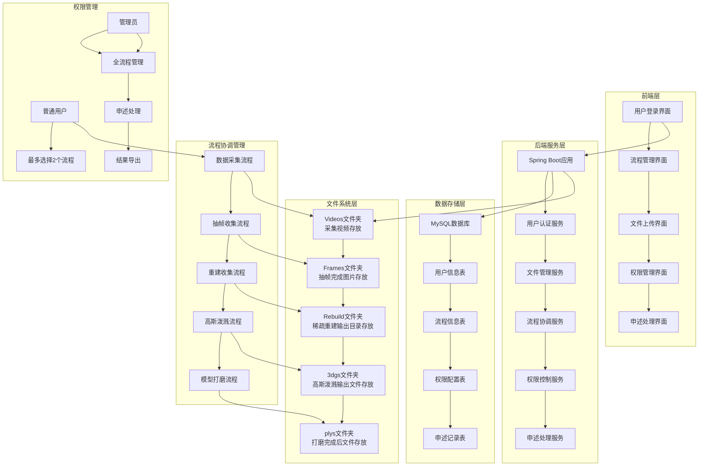
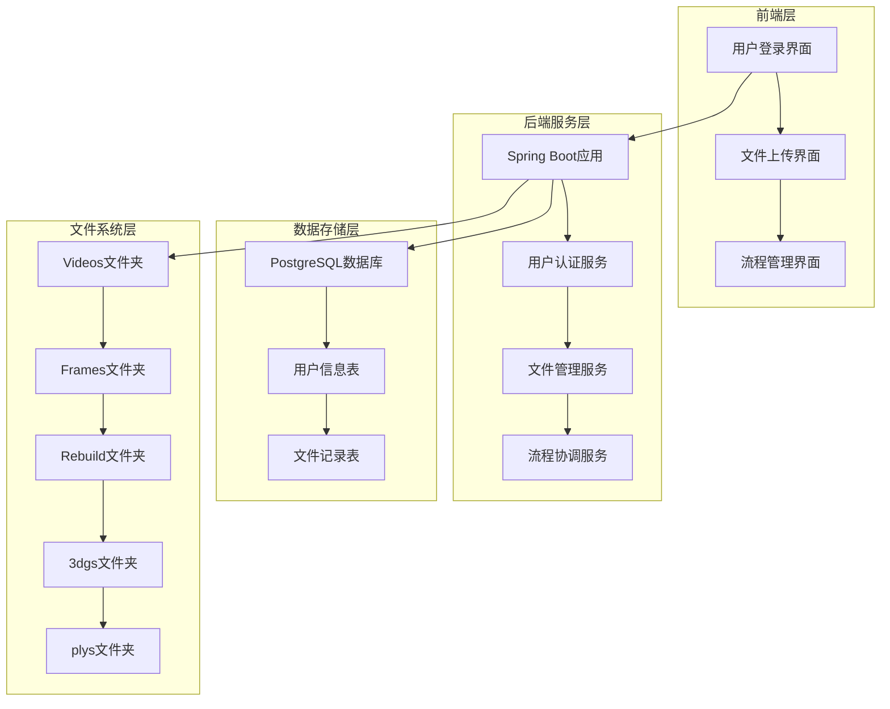
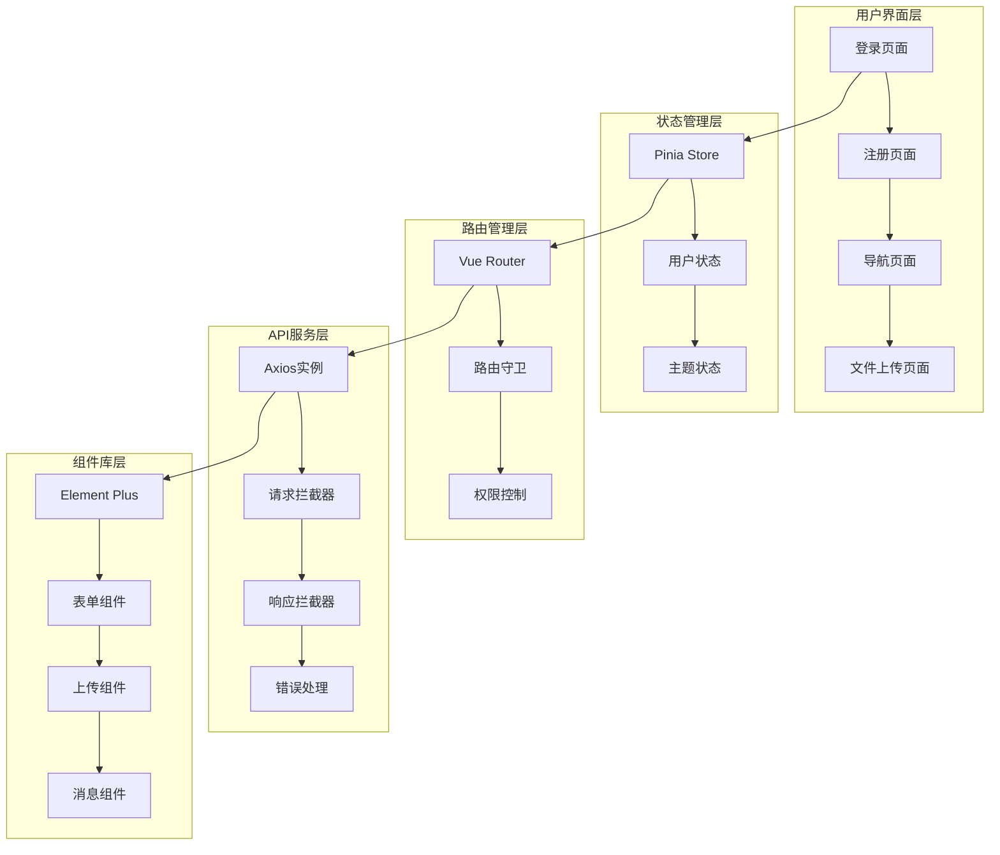

## 2025-9-26 （本科三年级）| 项目：三维重建全流程文件智慧管理系统

### 项目背景
承接三维重建项目全流程管理需求，针对三维重建需要分步完成相应流程、流程内需上传下载以及流程占用等任务协调问题，开发一套完整的全流程智慧管理系统，为三维重建工作提供文件管理和流程协调支持。

### 我的角色
全栈开发负责人（独立完成系统架构设计、前后端开发、数据库设计、文件管理系统开发与权限控制）

### 系统架构图

### 核心功能实现

#### 1. 文件管理系统
- **分层存储架构**：按流程步骤分文件夹存储（Videos、Frames、Rebuild、3dgs、plys）
- **智能文件命名**：`20250921-TuLou-xxxxxxxx`格式（日期+作品名+唯一标识符）
- **压缩包管理**：支持视频集合、图片集合、工作目录、点云文件等压缩包处理
- **文件流转控制**：上一流程完成后自动流转到下一流程，支持文件接收和上传

#### 2. 流程协调管理系统
- **五步流程支持**：数据采集 → 抽帧收集 → 重建收集 → 高斯泼溅 → 模型打磨
- **流程状态管理**：支持流程创建、进行中、完成、异常申述等状态跟踪
- **流程占用机制**：用户确认操作后流程显示"XXX工作中"，其他用户无法访问
- **异常处理机制**：支持流程申述，管理员可下载文件处理后销毁异常流程

#### 3. 用户权限分级管理系统
- **普通用户权限**：最多选择2个流程步骤进行处理，流程占用期间无法访问其他流程
- **管理员权限**：流程权限分配、申述处理、结果导出等管理功能
- **权限控制**：防止多用户同时操作同一流程，确保数据一致性

### 关键成就
1. **文件管理创新**：创新的文件命名规则和分层存储架构，提升文件管理效率
2. **流程协调优化**：实现多用户协作的流程管理机制，避免工作冲突
3. **权限控制完善**：实现多级权限管理和流程占用机制，确保系统安全性
4. **用户体验优化**：直观的流程界面设计，简化用户操作流程

### 项目成果
成功构建了包含文件管理、流程协调、权限控制、异常处理等核心功能的三维重建全流程文件智慧管理系统。系统架构清晰、功能完整、权限管理灵活，为三维重建项目提供了全面的文件管理和流程协调解决方案，体现了全栈开发能力和系统设计思维。

### 地点
厦门工学院人工智能创作坊AI应用速推工作室

## 2025-10-10 （本科三年级）| 项目：三维重建全流程文件智慧管理系统后端开发

### 项目背景
承接三维重建项目全流程管理需求，针对三维重建需要分步完成相应流程、流程内需上传下载以及流程占用等任务协调问题，开发一套完整的全流程智慧管理系统后端服务，为三维重建工作提供文件管理和流程协调支持。

### 我的角色
后端开发负责人（独立完成Spring Boot架构设计、RESTful API开发、数据库设计、文件管理系统开发与安全认证）

### 技术栈/工具
- **后端框架**：Spring Boot 3.5.5（采用Java 21最新LTS版本）
- **数据访问**：Spring Data JPA + Hibernate（实现ORM映射与数据库操作）
- **安全认证**：Spring Security + JWT（实现用户身份认证与权限控制）
- **数据存储**：PostgreSQL 12+（存储用户信息与文件记录）
- **参数校验**：Spring Boot Validation + Jakarta Validation（实现数据格式与业务逻辑校验）
- **代码简化**：Lombok（减少样板代码，提高开发效率）
- **文件处理**：MultipartFile（支持大文件上传，最大2GB）
- **开发工具**：IntelliJ IDEA、Maven（项目构建与依赖管理）

### 核心功能实现

#### 1. 用户管理系统
- **用户注册**：支持学号（20-30开头的10位数字）、姓名（2-20字符）、密码（6-20字符）注册
- **用户登录**：基于JWT Token的无状态身份认证，7天有效期
- **Token验证**：提供Token有效性验证和用户信息查询接口
- **安全加密**：使用BCrypt算法加密存储密码，确保数据安全

#### 2. 文件管理系统
- **视频压缩包上传**：支持最大2GB的视频压缩包上传功能
- **文件命名规则**：`20250921-TuLou-xxxxxxxx`格式（日期+作品名+唯一标识符）
- **文件存储**：分层存储架构，按流程步骤分文件夹存储
- **文件记录**：数据库记录文件上传信息，包含上传者、处理者、上传时间等

#### 3. 数据库设计
- **用户表（users）**：存储用户基础信息，学号唯一约束
- **视频压缩包表（video_zip_file）**：存储文件上传记录，支持流程跟踪
- **自动建表**：使用JPA自动创建和更新表结构
- **数据验证**：实体层和DTO层双重验证机制

#### 4. 安全认证系统
- **JWT认证**：无状态的身份认证，支持分布式部署
- **Spring Security**：企业级安全框架保护
- **权限控制**：基于Token的API访问控制
- **异常处理**：全局异常处理机制，统一错误响应格式

### 技术实现亮点

#### 1. 现代化技术栈
- **Spring Boot 3.5.5**：使用最新稳定版本，支持Java 21特性
- **PostgreSQL**：企业级数据库，支持复杂查询和事务处理
- **JWT 0.12.6**：最新JWT库，提供安全的Token管理

#### 2. 架构设计优化
- **分层架构**：Controller-Service-Repository-Entity清晰分层
- **模块化设计**：按业务功能划分包结构，便于维护和扩展
- **统一响应**：ApiResponse统一响应格式，提升API一致性
- **配置管理**：独立的配置类管理，支持多环境部署

#### 3. 文件处理能力
- **大文件支持**：支持最大2GB文件上传，满足三维重建项目需求
- **智能命名**：自动生成可读性强的文件命名规则
- **存储优化**：分层存储架构，按流程步骤组织文件

### 项目架构设计

#### 系统架构图

### 关键成就
1. **技术前瞻性**：使用Spring Boot 3.5.5 + Java 21最新技术栈，体现技术学习能力
2. **安全加固**：实现JWT + Spring Security双重安全机制，确保系统安全
3. **文件处理**：支持大文件上传和智能文件管理，满足三维重建项目需求
4. **架构设计**：采用分层架构和模块化设计，提升代码可维护性

### 项目成果
成功构建了包含用户管理、文件上传、安全认证等核心功能的三维重建全流程文件智慧管理系统后端服务。系统架构清晰、功能完整、安全可靠，为三维重建项目提供了稳定的后端支撑，体现了现代化后端开发的最佳实践。

### 地点
厦门工学院人工智能创作坊AI应用速推工作室

## 2025-10-10 （本科三年级）| 项目：三维重建全流程文件智慧管理系统前端开发

### 项目背景
承接三维重建项目全流程管理需求，针对三维重建需要分步完成相应流程、流程内需上传下载以及流程占用等任务协调问题，开发一套完整的全流程智慧管理系统前端应用，为用户提供直观友好的操作界面和流畅的交互体验。

### 我的角色
前端开发负责人（独立完成Vue3架构设计、组件开发、状态管理、路由设计、主题系统与响应式布局）

### 技术栈/工具
- **前端框架**：Vue 3.4.0（采用Composition API最新特性）
- **开发语言**：TypeScript 5.0.0（提供类型安全与代码提示）
- **构建工具**：Vite 5.0.0（快速构建与热重载）
- **UI组件库**：Element Plus 2.4.0（企业级UI组件）
- **状态管理**：Pinia 2.1.7（Vue3官方推荐状态管理）
- **路由管理**：Vue Router 4.2.5（单页面应用路由）
- **HTTP客户端**：Axios 1.6.0（API请求与响应拦截）
- **工具库**：@vueuse/core 10.7.0（Vue组合式函数库）
- **代码规范**：ESLint（代码质量检查）
- **开发工具**：Cursor、Visual Studio Code

### 核心功能实现

#### 1. 用户认证系统
- **用户注册**：支持学号（20-30开头的10位数字）、姓名（2-20字符）、密码（6-20字符）注册
- **用户登录**：JWT Token认证机制，支持记住我功能
- **自动跳转**：Token有效时自动跳转到导航页，未登录用户自动跳转到登录页
- **路由守卫**：基于Token验证的路由权限控制
- **用户信息显示**：所有页面显示用户真实姓名，提供个性化体验

#### 2. 文件管理系统
- **视频压缩包上传**：支持.zip、.rar、.7z格式，最大2GB文件上传
- **拖拽上传**：支持拖拽文件到上传区域，提升用户体验
- **上传进度**：实时显示上传进度条和状态信息
- **文件验证**：自动验证文件格式和大小，提供友好错误提示
- **智能命名**：自动生成`20250921-TuLou-xxxxxxxx`格式的文件名

#### 3. 流程管理界面
- **数据采集**：视频文件上传界面，支持大文件上传
- **抽帧收集**：接收视频文件进行抽帧处理（功能预留）
- **重建收集**：接收抽帧图片进行稀疏重建（功能预留）
- **高斯泼溅**：接收重建数据进行高斯泼溅处理（功能预留）
- **模型打磨**：接收高斯泼溅结果进行模型打磨（功能预留）
- **流程管理**：查看和管理所有流程状态（功能预留）

#### 4. 界面设计系统
- **极简主义设计**：采用现代化卡片式界面设计
- **响应式布局**：支持移动端和桌面端完美适配
- **主题切换**：支持白天/黑夜主题切换，提升用户体验
- **交互动画**：流畅的悬停效果和过渡动画
- **渐变背景**：美观的渐变背景设计

### 技术实现亮点

#### 1. 现代化前端架构
- **Vue 3 Composition API**：使用最新的组合式API，提升代码复用性
- **TypeScript**：提供完整的类型安全，减少运行时错误
- **Vite构建**：快速的热重载和构建速度，提升开发效率

#### 2. 状态管理优化
- **Pinia状态管理**：使用Vue3官方推荐的状态管理库
- **持久化存储**：Token和用户信息本地存储
- **响应式数据**：基于Vue3响应式系统的状态管理

#### 3. 用户体验优化
- **主题系统**：支持系统主题检测和手动切换
- **响应式设计**：移动端和桌面端完美适配
- **加载状态**：上传进度和加载状态可视化
- **错误处理**：友好的错误提示和异常处理

#### 4. 开发体验提升
- **代码规范**：ESLint代码质量检查
- **模块化设计**：组件化开发，便于维护和扩展
- **API封装**：统一的API请求封装和响应处理

### 项目架构设计

#### 前端架构图

### 关键成就
1. **技术前瞻性**：使用Vue 3 + TypeScript + Vite最新技术栈，体现前端技术学习能力
2. **用户体验**：实现响应式设计和主题切换，提升用户交互体验
3. **代码质量**：采用TypeScript和ESLint，确保代码质量和可维护性
4. **架构设计**：模块化组件设计和状态管理，提升代码复用性

### 项目成果
成功构建了包含用户认证、文件上传、流程管理、主题切换等核心功能的三维重建全流程文件智慧管理系统前端应用。界面美观、交互流畅、功能完整，为用户提供了现代化的操作体验，体现了前端开发的最佳实践和用户体验设计能力。

### 地点
厦门工学院人工智能创作坊AI应用速推工作室

## 2025-11-20 （本科三年级）| 项目：三维重建全流程文件智慧管理系统后端功能扩展

### 项目背景
基于已完成的三维重建全流程文件智慧管理系统基础功能，针对抽帧文件管理、任务管理系统、统一认证平台集成等需求，独立完成系统功能扩展，构建更完善的流程管理和任务协调解决方案，实现从视频上传到模型生成的完整流程管理。

### 我的角色
后端功能扩展负责人（独立完成API接口开发、任务管理系统设计、统一认证平台集成、数据库设计优化与系统集成）

### 技术栈/工具
- **后端框架**：Spring Boot 3.5.5（延续现有技术栈）
- **数据访问**：Spring Data JPA + Hibernate（实现ORM映射与数据库操作）
- **安全认证**：统一认证平台JWT Token（通过UnifiedAuthUtil工具类集成）
- **数据存储**：PostgreSQL 12+（存储文件记录与任务信息）
- **参数校验**：Spring Boot Validation + Jakarta Validation（实现数据格式与业务逻辑校验）
- **代码简化**：Lombok（减少样板代码，提高开发效率）
- **文件处理**：MultipartFile（支持大文件上传，最大2GB）
- **HTTP客户端**：RestTemplate（调用统一认证平台API）
- **开发工具**：IntelliJ IDEA、Maven（项目构建与依赖管理）

### 核心功能实现

#### 1. 抽帧文件管理模块
- **获取帧压缩文件信息**：`GET /api/framesZipFile/{id}` - 通过ID获取帧压缩文件详细信息，包含上传学生姓名、处理学生姓名等
- **接收帧压缩文件任务**：`GET /api/framesZipFile/receiveTask/{id}` - 学生接收帧压缩文件处理任务，自动创建任务记录并更新处理学生ID
- **获取已接收任务列表**：`GET /api/framesZipFile/receivedTasks` - 获取当前学生已接收的所有帧压缩文件处理任务列表，支持任务状态筛选
- **下载帧压缩文件**：`GET /api/framesZipFile/download/{id}` - 学生根据任务ID下载自己已接收的帧压缩文件，支持权限验证
- **删除帧任务**：`DELETE /api/framesZipFile/tasks/{id}` - 删除学生已接收的未完成帧任务，释放对应帧压缩文件供其他学生接收
- **完成任务**：`POST /api/framesZipFile/completeTask` - 学生完成任务并上传模型文件压缩包，自动保存到`uploads/Models`目录并更新任务状态

#### 2. 视频文件管理模块扩展
- **任务接收功能**：`POST /api/videoZipFile/accept-task` - 学生接收视频压缩文件处理任务，支持任务分配与状态更新
- **任务列表查询**：`GET /api/videoZipFile/tasks` - 获取当前学生已接收的所有视频压缩文件处理任务列表，包含任务状态信息
- **任务删除功能**：`DELETE /api/videoZipFile/tasks` - 删除学生已接收的未完成视频任务，释放视频文件供其他学生接收
- **任务完成功能**：`POST /api/videoZipFile/complete-task` - 完成任务并上传视频帧压缩包，自动保存到`uploads/Frames`目录并创建FramesZipFileEntity记录

#### 3. 统一认证平台集成
- **UnifiedAuthUtil工具类**：封装统一认证平台API调用，提供Token验证和学生信息查询功能
- **获取学生数据库ID**：通过Token调用统一认证平台接口，获取学生在数据库中的唯一ID，用于系统内部关联
- **获取学生姓名**：通过数据库主键ID调用统一认证平台接口，获取学生姓名信息，用于前端展示
- **异常处理机制**：完善的统一认证平台服务异常处理，确保系统稳定性
- **RestTemplate配置**：配置RestTemplate用于HTTP请求，支持统一认证平台API调用

#### 4. 任务管理系统
- **VideoTaskEntity实体**：视频任务实体，包含学生ID、文件ID、任务状态、接收时间等字段，支持任务生命周期管理
- **FramesTaskEntity实体**：帧任务实体，包含学生ID、文件ID、任务状态、接收时间等字段，支持帧任务生命周期管理
- **任务状态管理**：支持任务状态跟踪（未完成/已完成），通过taskStatus字段标识任务完成状态
- **任务接收机制**：学生接收任务时自动创建任务记录，更新文件处理学生ID，防止多用户同时操作
- **任务权限控制**：确保学生只能操作属于自己的任务，通过Token验证和数据库ID比对实现权限控制
- **任务删除限制**：仅允许删除未完成的任务，已完成任务不可删除，确保数据完整性

### 技术实现亮点

#### 1. 统一认证平台集成架构
- **工具类封装**：UnifiedAuthUtil工具类统一管理统一认证平台API调用，提升代码复用性
- **异常处理**：完善的异常处理机制，统一认证平台服务异常时提供友好的错误提示
- **配置管理**：通过application.yml配置统一认证平台基础URL，支持多环境部署
- **数据关联**：通过统一认证平台获取学生数据库ID，实现跨系统数据关联

#### 2. 任务管理系统设计
- **实体设计**：VideoTaskEntity和FramesTaskEntity实体设计，支持任务生命周期完整管理
- **状态跟踪**：通过taskStatus字段实现任务状态跟踪，支持未完成/已完成两种状态
- **自动时间戳**：使用@PrePersist注解自动生成任务接收时间，确保时间准确性
- **任务关联**：通过fileId字段关联文件实体，实现任务与文件的关联关系

#### 3. 文件流转管理
- **流程衔接**：视频压缩包上传 → 接收任务 → 完成任务上传帧压缩包 → 接收帧任务 → 完成任务上传模型文件
- **文件存储**：按流程步骤分文件夹存储（Videos、Frames、Models），支持文件流转跟踪
- **文件关联**：通过videoZipFileTableId字段实现视频、帧、模型文件的关联，形成完整的数据链
- **状态同步**：任务完成时自动更新文件处理状态，确保数据一致性

#### 4. 权限控制机制
- **Token验证**：所有需要认证的接口都通过统一认证平台验证Token有效性
- **学生身份验证**：通过Token获取学生数据库ID，确保操作权限正确
- **任务权限控制**：学生只能操作属于自己的任务，通过数据库ID比对实现权限验证
- **文件权限控制**：下载和删除操作都进行权限验证，确保数据安全

### 关键成就
1. **功能扩展完整性**：新增抽帧文件管理模块，扩展视频文件管理模块任务管理功能，完善系统功能体系
2. **系统集成能力**：成功集成统一认证平台，实现跨系统数据关联和用户身份验证
3. **任务管理创新**：设计完整的任务管理系统，支持任务接收、查询、删除、完成等全生命周期管理
4. **代码质量提升**：采用工具类封装、异常处理、权限控制等最佳实践，提升代码可维护性和安全性

### 项目成果
成功扩展了三维重建全流程文件智慧管理系统的后端功能，新增抽帧文件管理模块（6个API接口）、扩展视频文件管理模块任务管理功能（4个API接口）、集成统一认证平台、实现完整的任务管理系统。系统功能更加完善、任务管理更加灵活、数据流转更加顺畅，为三维重建项目提供了更全面的流程管理和任务协调解决方案，体现了系统集成能力和任务管理设计能力。

### 地点
厦门工学院人工智能创作坊AI应用速推工作室

## 2025-11-20 （本科三年级）| 项目：三维重建全流程文件智慧管理系统前端功能扩展

### 项目背景
基于已完成的三维重建全流程文件智慧管理系统基础功能，针对抽帧任务管理、重建收集页面优化、统一认证平台集成等需求，独立完成前端系统功能扩展，构建更完善的抽帧任务管理和数据加载机制，实现从视频上传到模型生成的完整前端流程支持。

### 我的角色
前端功能扩展负责人（独立完成Vue3组件开发、API接口封装、数据加载优化、统一认证平台集成、界面优化与用户体验提升）

### 技术栈/工具
- **前端框架**：Vue 3.4.0（延续现有技术栈，采用Composition API模式）
- **开发语言**：TypeScript 5.0.0（提供类型安全与代码提示）
- **构建工具**：Vite 5.0.0（快速构建与热重载）
- **UI组件库**：Element Plus 2.4.0（企业级UI组件）
- **状态管理**：Pinia 2.1.7（管理用户登录状态与任务数据）
- **路由管理**：Vue Router 4.2.5（单页面应用路由）
- **HTTP客户端**：Axios 1.6.0（API请求与响应拦截，支持独立实例配置）
- **代码规范**：ESLint（代码质量检查）
- **开发工具**：Cursor、Visual Studio Code

### 核心功能实现

#### 1. 抽帧任务管理模块
- **图片帧任务查看**：我的任务页面新增"图片帧任务"视图，调用`GET /api/framesZipFile/receivedTasks`接口，学生可快速查看自己接收的所有抽帧任务列表
- **帧任务完成任务**：支持上传模型文件压缩包完成任务，调用`POST /api/framesZipFile/completeTask`接口，使用FormData上传taskId和file，完成任务后任务状态自动更新为已完成
- **帧任务删除功能**：新增`deleteFramesTask`接口封装，对接`DELETE /api/framesZipFile/tasks/{id}`接口，删除后自动释放任务占用，供其他学生接收
- **任务操作隔离**：图片帧任务列表改为只读模式，避免与视频任务的下载、完成、删除操作混淆，交互更加清晰
- **接口封装同步**：在`src/api/file/frames.api.ts`中补充`getReceivedFramesTasks`方法与`FramesTaskItem`类型，确保与后端返回结构完全一致

#### 2. 重建收集页面优化
- **一次性加载全部数据**：重建收集页面改为一次性加载全部数据，通过连续失败计数（连续10次失败）判断数据加载完成，简化用户交互流程，无需手动滚动触发
- **ID递增加载机制**：基于固定ID递增的拉取模式，使用while循环持续加载直到连续失败达到阈值，实现自动化数据拉取
- **重建任务数据同步**：`FramesZipFileInfo`类型替换为`studentName`、`processStudentName`字段，完全对齐《Frames接口文档》最新返回结构
- **抽帧任务展示优化**：重建收集页面表格改用学生姓名展示处理进度，并为未认领任务提供友好占位文案，提升用户体验
- **抽帧任务接取**：重建收集页面新增"接收任务"按钮，调用`GET /api/framesZipFile/receiveTask/{id}`接口完成任务接取，并提供加载反馈与错误提示

#### 3. 统一认证平台集成
- **登录接口迁移**：登录接口迁移至统一认证平台（http://10.0.48.168:7001），实现跨系统用户身份认证
- **接口配置分离**：认证接口和业务接口使用独立的axios实例（authApi和fileApi），认证接口baseURL为`http://10.0.48.168:7001/api/v1/students`，业务接口baseURL为`http://10.0.48.241:8080/api`
- **Token管理优化**：通过独立axios实例实现Token的自动注入和管理，认证接口和业务接口分别处理各自的响应拦截逻辑
- **异常处理机制**：完善的统一认证平台服务异常处理，确保系统稳定性

#### 4. 界面优化与用户体验提升
- **夜间模式表头透明化**：重建收集页面夜间模式表格表头背景改为完全透明，统一透明度层级，保留数据行深色对比，提升视觉一致性
- **主题切换优化**：所有页面主题切换统一使用`src/assets/AiWorkShop_icon.png`图标，保持界面风格统一
- **加载状态优化**：实现加载动画、进度条、错误处理等用户体验细节，提升交互反馈
- **接口变更记录**：README新增重建任务接口字段更新说明，方便团队快速了解前端同步内容

### 技术实现亮点

#### 1. 数据加载机制优化
- **自动化加载**：通过ID递增加载机制和连续失败计数，实现数据自动拉取，无需用户手动操作
- **性能优化**：一次性加载全部数据，减少网络请求次数，提升页面加载效率
- **错误处理**：通过连续失败计数机制，智能判断数据加载完成状态，避免无限循环

#### 2. 接口封装与类型安全
- **TypeScript类型定义**：为所有API接口定义完整的TypeScript类型，确保类型安全
- **接口封装统一**：统一封装API调用逻辑，提供一致的错误处理和响应格式
- **数据结构同步**：确保前端类型定义与后端返回结构完全一致，避免运行时错误

#### 3. 统一认证平台集成架构
- **独立实例配置**：认证接口和业务接口使用独立的axios实例，实现配置隔离
- **Token自动注入**：通过请求拦截器自动注入Token，简化API调用逻辑
- **响应拦截优化**：分别处理认证接口和业务接口的响应拦截，提供统一的错误处理

#### 4. 用户体验优化
- **任务操作隔离**：不同类型任务采用不同的操作模式，避免操作混淆
- **视觉一致性**：统一主题切换图标和夜间模式样式，提升界面美观度
- **交互反馈**：完善的加载状态、错误提示、成功反馈，提升用户操作体验

### 关键成就
1. **功能扩展完整性**：新增抽帧任务管理模块，扩展重建收集页面功能，完善系统任务管理体系
2. **数据加载优化**：实现ID递增加载机制和一次性加载全部数据，大幅提升数据加载效率和用户体验
3. **系统集成能力**：成功集成统一认证平台，实现跨系统用户身份认证和接口配置分离
4. **代码质量提升**：采用TypeScript类型定义、接口封装、异常处理等最佳实践，提升代码可维护性和安全性
5. **用户体验优化**：通过界面优化、交互反馈、视觉一致性提升，显著改善用户操作体验

### 项目成果
成功扩展了三维重建全流程文件智慧管理系统的前端功能，新增抽帧任务管理模块（任务查看、完成任务、删除任务）、优化重建收集页面（ID递增加载、一次性加载全部数据、任务接取）、集成统一认证平台（接口配置分离、Token管理优化）、提升界面体验（夜间模式优化、主题切换统一）。系统功能更加完善、数据加载更加高效、用户体验更加友好，为三维重建项目提供了更全面的前端流程管理和任务协调解决方案，体现了前端开发能力和用户体验设计能力。

### 地点
厦门工学院人工智能创作坊AI应用速推工作室

